 AuthorsOnly

1st September 2023

Prepared By: `PhiloMatta`

Challenge Author(s): `Amr006`,`PhiloMatta`

Difficulty: Easy

  

# Synopsis (!)

- This challenge requires participants to exploit GraphQL and LFI vulnerabilities to obtain the flag.

## Description (!)

- This challenge requires understanding the authentication happening and trying to understand the graphql language and and simple understanding of the Lfi.

## Skills Required (!)

- Python
- Researching Skills
- graphql
- LFI

## Skills Learned (!)

- Learn how Graphql works.
- Learn how to do basic mutation and get queries in graphql.
- Learn how to do a Lfi.

# Enumeration (!)

-on visting the site you are greeted with a login page and no sign for a register which means you have to be a valid user only to access the service.

-Checking the Devtool through network tab a request is made to a Graphql endpoint..

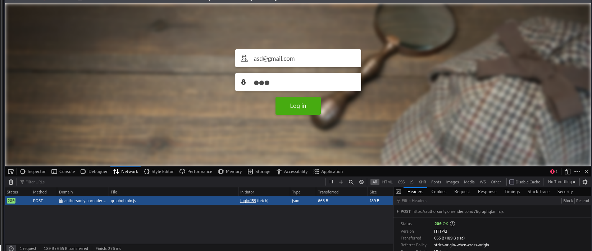

- So GraphQL is a query language for APIs and a runtime for fulfilling those queries with your existing data... 

   So among the queries you can make two are very important:
    1-introspection query which can be used to know the schema and the objects in the database
    2-mutation query which is similar to an insert query where you can add for instance new users
    
     So in order to run an introspection query i used curl...
     
   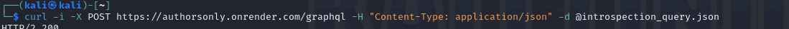

     and here is the content for introspection_query json file 
     
     
     
     
     
 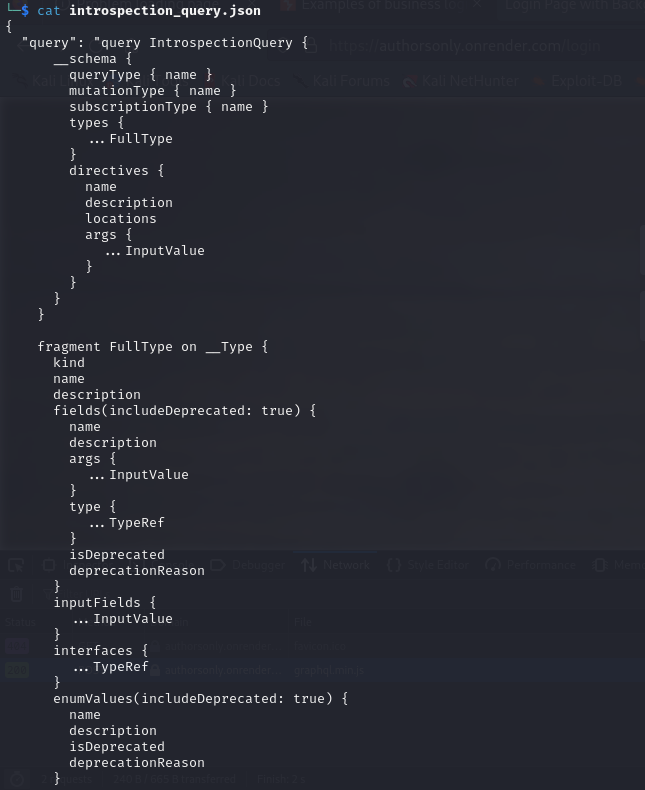 
 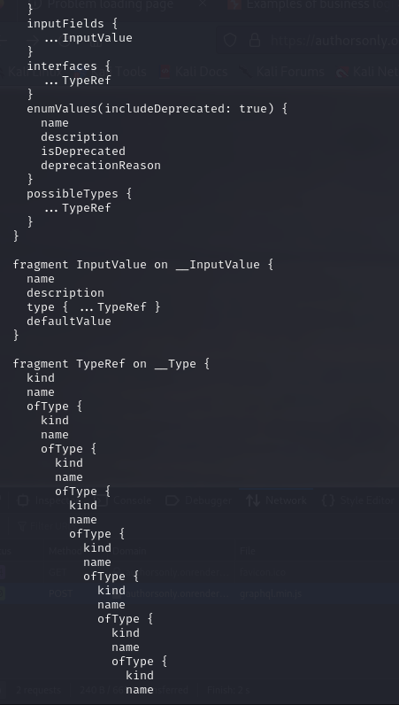  
 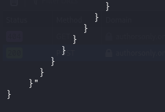   

- i get the following response from the curl command.

 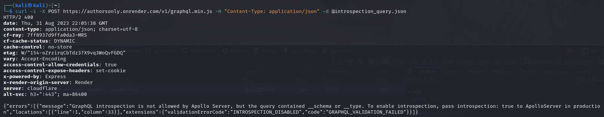   
 
- Which means i have to do it manually,

  when trying to write an object name the language gives you an indicator which is a potential to find most objects and map the scema yourself and its called Blind introspection.

  here is an example where i sent an incorrect query with the auth object but it got corrected to author
  
  
  
 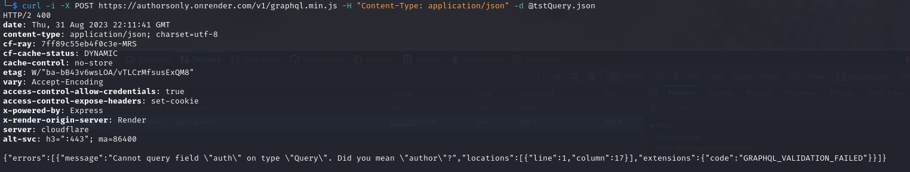 
 
- So you can either fuzz for schema or use a tool that does that for you (Tool used clairvoyance).

- i used the tool and ran it and saved the output in schema.json and got the following .

 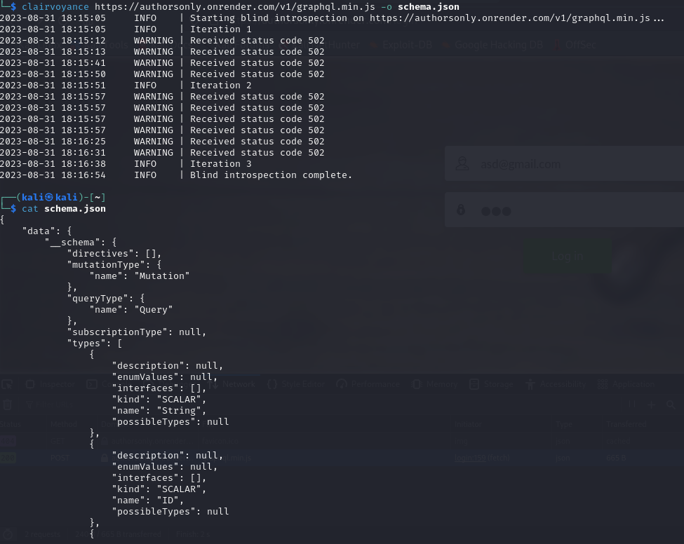 
- you can either take the content of the schema and run it through a beautifier or just use chatGpt..

 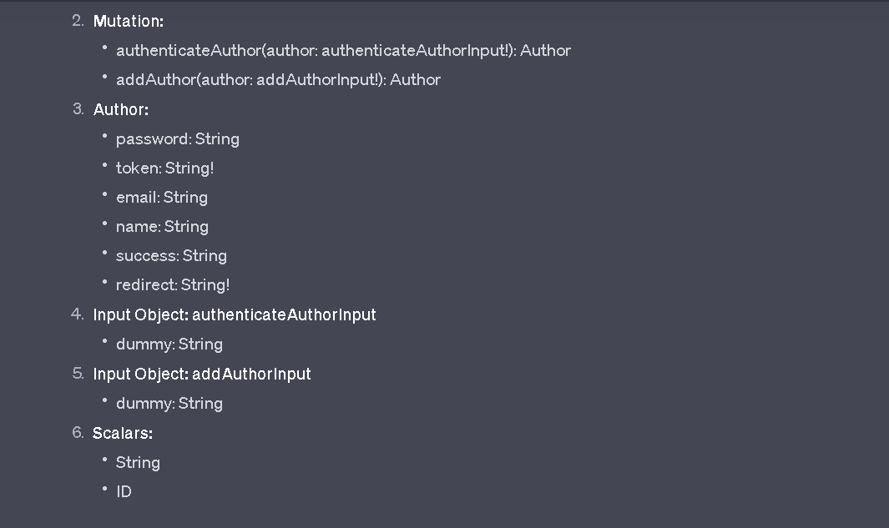  
- we can see that there is an author object with the email / password fields.. so i ran a query to get the content... 
  query content:
  
  
  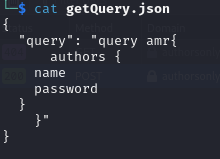 
  
  
  
  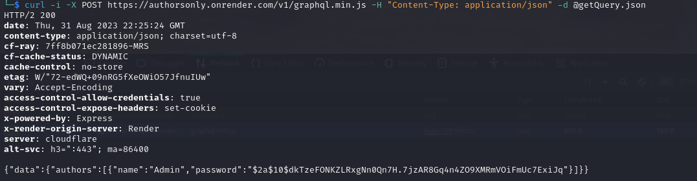 
- it seems to be a hard hash to break so we can either try to break which would be impossible or we can use a mutation query to insert a user in the database.

  mutation Query content:  
  
  
  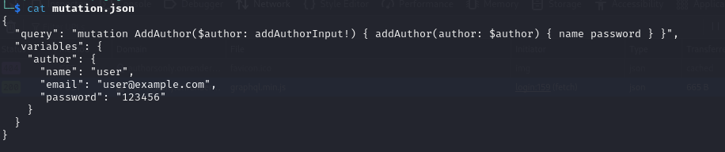 
  
  
  
  
  
  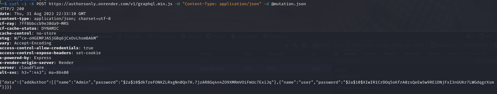
- so a user is inserted in the database successfully now i can login with the email and password..

   
# Solution (!)

- on login i am greeted with a home page displaying book contents and upon clicking any book the url is updated with a file parameter.

  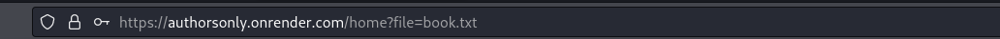
  
- so on first thought an LFi could arrise here so i tried to get the content of the etc/passwd file and it worked.

  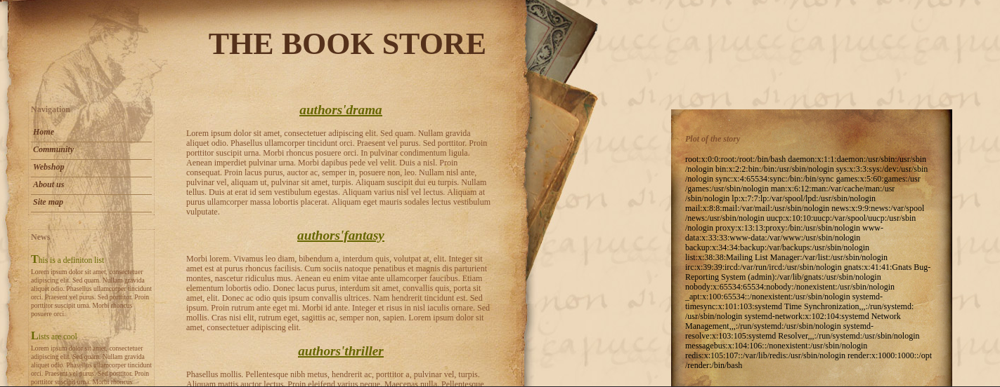  
   
# Getting the flag (!)

- so the flag could be in this directory or the one before so its a matter of guessing and here is the flag.....

  
  
